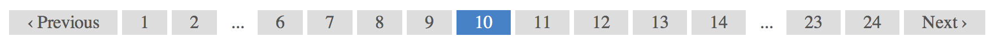
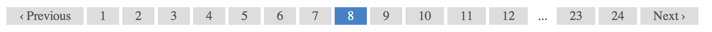

# Pagination Helper

You&#8217;ve probably been doing pagination more than once in your life as a developer; and most likely in
more than one language, right? Yeah, so have I &#8212; and every time I&#8217;ve said to myself: "Why can&#8217;t
I just include some kind of file that does this and be done with it already?".
So I finally went and built a general purpose, easily modifiable way to paginate stuff with XSLT, and I couldn&#8217;t
think of a single reason why it shouldn&#8217;t be available to you too, so here it is. 

This was developed while using the excellent [Umbraco CMS](http://umbraco.com) but I have extracted the generic bits so
it should be usable as a drop-in solution whenever you&#8217;re doing XSLT and suddenly get that "Oh, I guess I&#8217;ll need
to paginate this set..." feeling.

## How to use it

There&#8217;s very little work involved in using the Pagination Helper, basically you do three things:

* Include `_PaginationHelper.xslt` in your main XSLT file (e.g. an Umbraco macro XSLT file)

```xslt
<xsl:include href="_PaginationHelper.xslt" />
```

* Create a *template* for a single item to be rendered (e.g. a search result or a thumbnail image)

```xslt
<xsl:template match="Textpage">
	<li>
		<a href="{umbraco.library:NiceUrl(@id)}">
			
		</a>
	</li>
</xsl:template>
```

* Call the `PaginateSelection` template where you want the paged result to appear 

```xslt
<xsl:template match="/">
	<xsl:call-template name="PaginateSelection">
		<xsl:with-param name="selection" select="$currentPage/Textpage" />
	</xsl:call-template>
</xsl:template>
```

Simple, huh?

## Details

By default, the `PaginateSelection` template will paginate the children of the context node when called, but you can
specify the exact selection of nodes to paginate by supplying the parameter `selection` when calling the template.
(So, in Umbraco, we&#8217;ll use `$currentPage` for context as long as we&#8217;re inside the *root* template.

If for some reason you need to render the *pager controls* in a specific place and not as part of the automatic
output, you can turn them off with the `showPager` parameter by supplying `false()` or `0` (zero). Then you
can manually output the controls by calling `RenderPager`, using the same `selection` parameter as you called the
`PaginateSelection` template with, to get the paging controls where you want them.

## Sorting the output

Sometimes, the data you want to paginate is actually also being sorted when rendered, e.g. like this common scenario:

```xslt
<xsl:apply-templates select="$currentPage/Textpage">
	<xsl:sort select="@createDate" order="descending" />
</xsl:apply-templates>
```

The problem with introducing pagination here, is that you'll get the pagination happening *before* sorting, but you really want to *sort* the results first and then perform the pagination. For that you use the `sortBy` parameter:

```xslt
<xsl:call-template name="PaginateSelection">
	<xsl:with-param name="selection" select="$currentPage/Textpage" />
	<xsl:with-param name="sortBy" select="'@createDate DESC'" />
</xsl:call-template>
```

*Note that it's a string combining the name of the element or attribute to sort by and the direction (`ASC` or `DESC`), separated by a space. `ASC` is the default so you don't even need to specify the direction, unless it's `DESC`.*

It won't cover every scenario, e.g. it doesn't do numerical sorting, and you can only sort by a single element/attribute, where the element has to be a direct child of the node being sorted. Still, this should cover **a lot** of use cases.

### Advanced sorting

Because XSLT allows for some very special sorting (e.g., sorting by a substring of a value or the combined value of two or more values), there need to be a way to support this, so by sending the string **'$CUSTOM'** into the `sortBy` parameter, the helper will execute a named template (**"customSort"**) to perform the sorting, so in that one you can just paste your existing sort statements, e.g.:

```xslt
<xsl:call-template name="PaginateSelection">
	<xsl:with-param name="selection" select="$currentPage/Textpage" />
	<xsl:with-param name="sortBy" select="'$CUSTOM'" />
</xsl:call-template>

...

<xsl:template name="customSort">
	<xsl:param name="selection" />
	<xsl:apply-templates select="$selection" mode="preSort">
		<xsl:sort select="substring-before(@nodeName, '-')" data-type="text" order="ascending" />
		<xsl:sort select="substring-after(@nodeName, '-')" data-type="number" order="ascending" />
	</xsl:apply-templates>
</xsl:template>
```

## QueryString options

The pager links rendered will include all existing querystring options on the original page (i.e., "page 1"), so if
that page was the result of a search, e.g.: `?search=pagination+in+xslt`, the page parameter will just be tacked on to that
so everything works as expected.

## Customization

The actual pagination is done with a *QueryString* parameter named `p`, which can be changed if you need to - it&#8217;s
defined in the *variable* `pagerParam` right at the top of the file. Here you can also change the wording of the
*Previous* and *Next* links generated, and the number of results per page (default is 10). You can even change the function that
retrieves the options for the current page, which defaults to the server variable `QUERY_STRING`
(using `umbraco.library:RequestServerVariables()`)  but if you&#8217;re not using this with Umbraco you&#8217;re bound to
get that from some other extension function. It assumes the standard query string `key=value&otherkey=othervalue` format.

Also, there's a variable to hold the current page's URL - again, you can set it any way you like; the default uses Umbraco's
`NiceUrl()` extension.

## Number of pages in the Pager output

If the amount of pages grows huge, it's common to limit the pager output to some amount of pages *before* and *after* the current page.
The Pagination Helper defaults this number to 4 pages before and after, but you can use the `pageLinksBeside` parameter to
override this value. You will always have links to the first and last couple of pages, though - like this, for page 10 of a 24-page set:



Note, however, that you will not get a *gap* (...) where it would be redundant, e.g. same setup as above, but on page 8, will look
like this:



— Where rendering a gap between 2 and 4 would be pretty pointless, wherefore you get a link to the third page as well (for free!).


